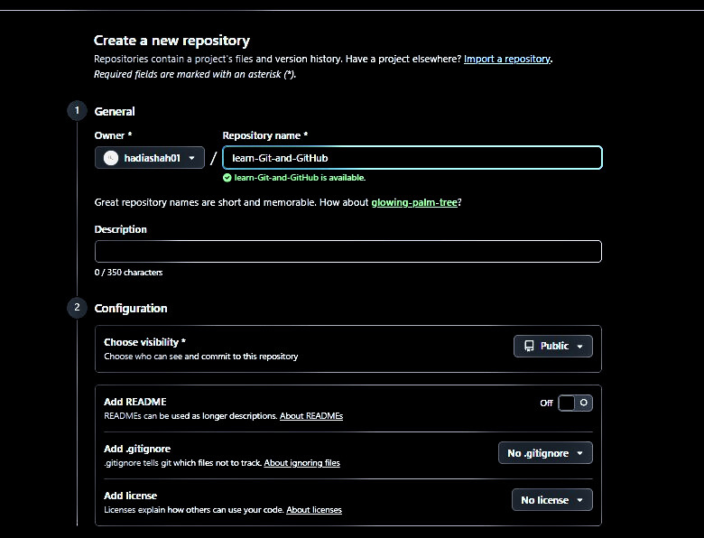
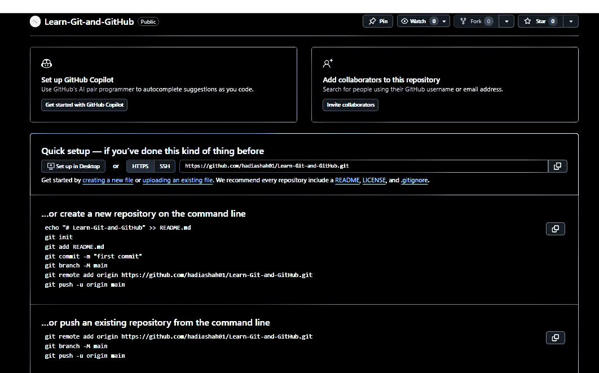
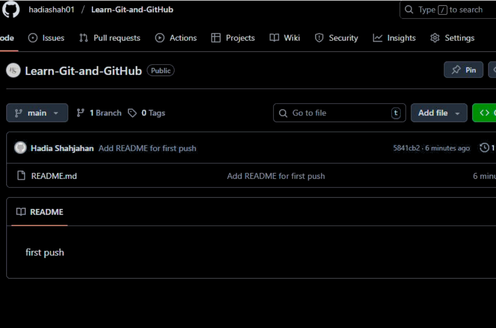
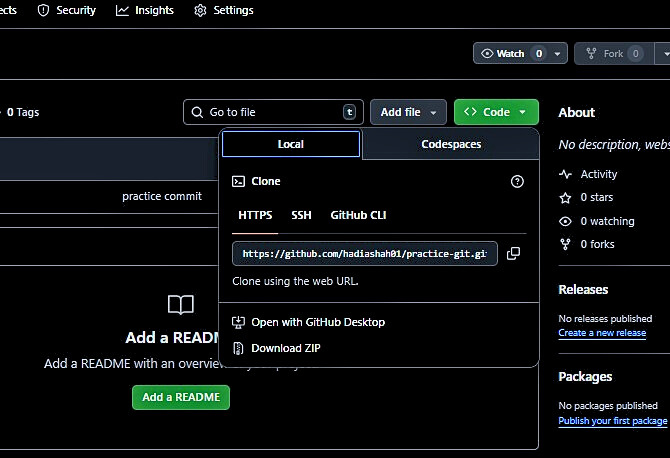

## GitHub Repository Creation (Screenshots)

### 1. Click **+ → New repository** to start repo creation ###

### 2. Enter repository name and select visibility ###

### 3. Click **Create repository** to generate repo  ###

### 4. Repository setup page shows **clone URL**  ###

### 5. Add **README.md** file to repository
  
### 6. Write commit message and click **Commit changes** ###

### 7. Repository is created with **first commit** ###

> **Note:** The clone URL is used to create a local copy of the GitHub repository on your system using Git.

